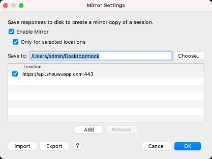

# 如何添加 mock 数据

## 编辑独立 mock 数据

- 右上角菜单“新增接口” 或目录下每个接口文件后面“编辑”按钮可以进入“新增/编辑接口页面”
- 在“新增/编辑页面”编辑 json 数据保存即可更新

## 使用 charles 工具保存 mock 数据

- 工具 charles 的安装这里就省略了
- 打开 charles 后，在 tools 菜单下选择 mirror 选项
- 如下图所示，配置要保存到的目录和域名
- 客户端代理连接 charles 访问后，指定域名的接口数据即可保存到对应目录
- 将上一步的数据目录复制到本服务 mock 目录下

## 开启转发自动保存 mock 数据
- 右上角菜单“开启转发”，开启转发模式
- 按照“前端如何接入使用”步骤接入后
- 客户端访问的请求会自动保存到本地 mock 目录下
